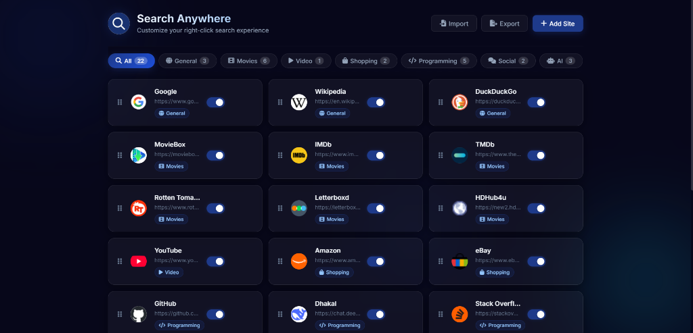
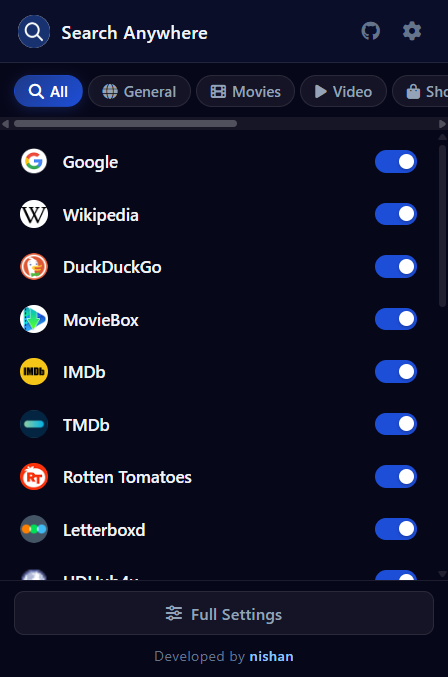

<p align="center">
  
</p>

# Search Anywhere — Chrome Extension

A premium, modern Chrome Extension (Manifest V3) that allows you to search selected text on any of your favorite websites directly from the right-click context menu. Fully customizable with categories, real-time website favicons, drag-and-drop ordering, and a sleek dark glassmorphism popup dashboard.

## Preview

<p align="center">
  
</p>

<p align="center">
  
</p>

## Features

- **Nested Context Menus:** Organizes your search engines into nested categories in the right-click menu.
- **Sleek Popup Dashboard:** Toggle search engines on/off instantly via the extension toolbar popup.
- **Custom Site Management:** Add new search engines, edit existing URLs, and delete unneeded ones.
- **Real favicon Integration:** Automatically fetches and displays high-quality website favicons for your search engines with initial-based fallbacks.
- **Drag-and-Drop Reordering:** Change the order of search engines in the context menu directly from the Settings page.
- **Import / Export Settings:** Save your custom search engine configuration to a JSON file or import a shared setup.
- **Premium Dark UI:** Designed with a stunning dark glassmorphism theme, smooth animations, and custom interactive tooltips.

## File Structure

```text
├── manifest.json         # Extension configuration (V3)
├── background.js         # Service worker handles context menus
├── icons/                # Extension logos (16, 32, 48, 128)
├── options/              # Full Settings dashboard
│   ├── options.html
│   ├── options.css
│   └── options.js
└── popup/                # Compact toolbar popup
    ├── popup.html
    ├── popup.css
    └── popup.js
```

## How to Install

1. Clone or download this repository to your local machine.
2. Open Google Chrome and navigate to `chrome://extensions/`.
3. Enable **Developer mode** (toggle in the top-right corner).
4. Click **Load unpacked** in the top-left corner.
5. Select the `search_extension` project directory.
6. The extension is now active! Select any text on a web page, right-click, and search.

## Development & Customization

The settings page supports a storage shim (`storageShim`) allowing you to run and design the `options.html` page directly in the browser (e.g. using VS Code's Live Server or other tools) without needing to pack and load the extension after every visual change.

Developed by [nishan](https://github.com/nishan023).
